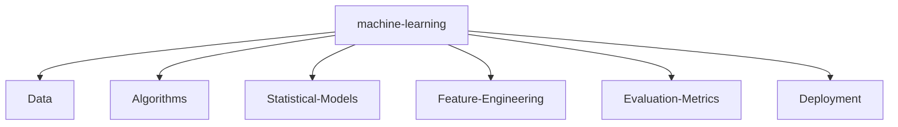

<!-- Header Section with Badges and Typing Animation -->

  
  
  
  
  
  

  

- 🌟 **To Learn More...!** [For the future hacker...](https://referral.hackthebox.com/mzGYlUJ)

---

## 📋 **Table of Contents**
- [Introduction](#-introduction)
- [Skills & Technologies](#-skills--technologies)
- [Projects Showcase](#-projects-showcase)
- [GitHub Stats & Analytics](#-github-stats--analytics)
- [Achievements & Trophies](#-achievements--trophies)
- [Machine Learning Roadmap](#-machine-learning-roadmap)
- [Contact & Connect](#-contact--connect)

---

## 📖 **Introduction**

Hey there! 👋 I'm **Kanak Baghel**, an aspiring Data Scientist passionate about turning data into actionable insights. With a BBA (FIA) background, I'm currently honing my skills through programs like **Emeritus @ IIT Guwahati** and internships at **TechNest**. I love exploring machine learning, deep learning, and everything in between!

  

*💡 Always open to collaborations, discussions, and learning opportunities!*

---

## 🛠️ **Skills & Technologies**

Here's a breakdown of my expertise across various domains:

<table align="center">
  <tr>
    <th>Category</th>
    <th>Skills</th>
  </tr>
  <tr>
    <td><b>Programming Languages & IDEs</b></td>
    <td>
      
      
      
      
      
      
      
      
      
    </td>
  </tr>
  <tr>
    <td><b>Domain Knowledge</b></td>
    <td>
      
      
      
      
    </td>
  </tr>
  <tr>
    <td><b>CI/CD & Tools</b></td>
    <td>
      
      
      
      
      
      
      
    </td>
  </tr>
  <tr>
    <td><b>Databases</b></td>
    <td>
      
      
      
    </td>
  </tr>
  <tr>
    <td><b>ML/DL Frameworks</b></td>
    <td>
      
      
      
      
      
      
    </td>
  </tr>
</table>

  

---

## 📁 **Projects Showcase**

Dive into my key repositories showcasing real-world applications:

| Project | Description | Tech Stack | Link |
|---------|-------------|------------|------|
| **Emeritus Graded Projects** | Academic projects from IIT Guwahati program, including ML models and dashboards. | Python, Power BI, MySQL | [🔗 View Repo](https://github.com/Kanakbaghel/Emeritus-Graded-Projects) |
| **TechNest Internship** | 16-week internship tasks: ETL, ML, NLP, and deployments. | Python, TensorFlow, Flask | [🔗 View Repo](https://github.com/Kanakbaghel/TechNest-Internship-Data-Science) |
| **Python Journey** | beginner friendly repository; python for data science | Python | [🔗 View Repo](https://github.com/Kanakbaghel/Python_journey) |
| **Foresight PowerBI Internship** | Interactive Power BI dashboard for sales insights. | Power BI | [🔗 View Repo](https://github.com/Kanakbaghel/Foresight-PowerBI-Internship) |

*Explore more on my GitHub! 🚀*

---

## 🏆 **Achievements & Trophies**

  

<!-- Kaggle Section (Uncomment if applicable) -->
<!-- 
### My Achievements on [Kaggle](https://www.kaggle.com/yourusername):

-->

---

## 🧠 **Machine Learning Roadmap**

Visualizing my journey in ML:

---

## 📞 **Contact & Connect**

Let's connect and collaborate!

  
  
  

---

> _“Data becomes meaningful when it tells a story that leads to better decisions.”_

  <em>Crafted with ♥ by <strong>Kanak Baghel</strong></em> 
   
  *If you liked my profile, Star ⭐ the repos and Fork to use this template!*

